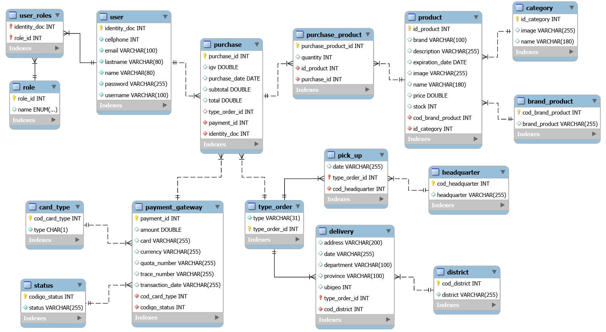

# API REST - Bodega BoraBora - APP Móvil Kotlin

 

## Repositorios relacionados

[API-REST-BoraBora-Kotlin](https://github.com/CarlosAcosta4/apirest-borabora-android-kotlin) &nbsp;| &nbsp; [AppBoraBora-Kotlin](https://github.com/brigittev0/AppBoraMovil) &nbsp;| &nbsp; [Resources-API](https://github.com/CarlosAcosta4/resources-apis-borabora) &nbsp;

Por favor, consulta los repositorios correspondientes para obtener instrucciones sobre cómo configurar y utilizar estas aplicaciones.

 

## Pre-requisitos

Antes de ejecutar este proyecto, debes asegurarte de que:

1. Tienes instalado Maven en tu sistema. Puedes verificarlo ejecutando `mvn -v` en la terminal.
2. Tienes instalado Spring Tool Suite (STS) u otro IDE compatible con proyectos Maven.
3. Tienes instalado MySQL y está corriendo en tu sistema.
4. No tienes una base de datos con el nombre especificado en el archivo `application.properties` (`bd_borabora` en este caso).
5. El puerto especificado en el archivo `application.properties` (`8070` en este caso) no está siendo utilizado por otra aplicación.
6. Los valores de `username` y `password` en el archivo `application.properties` coinciden con tus credenciales de MySQL.

 

## Ejecución

Para ejecutar este proyecto en Spring Tool Suite (STS), sigue estos pasos:

1. Importa el proyecto en STS: File -> Import -> Maven -> Existing Maven Projects.
2. Navega y selecciona el directorio del proyecto.
3. Haz clic en Finish para importar el proyecto.
4. Una vez importado, haz clic derecho en el proyecto en el explorador de proyectos.
5. Selecciona Run As -> Spring Boot App.
6. El proyecto debería comenzar a ejecutarse en el puerto especificado (8070 en este caso).

 

## Inserción de datos
Una vez que las tablas se han creado en la base de datos, puedes utilizar los scripts SQL disponibles en este [repositorio](https://github.com/CarlosAcosta4/resources-apis-borabora) para insertar datos.

 

  
## Arquitectura

 

## Diagrama Conceptual

 

## Diagrama Físico

